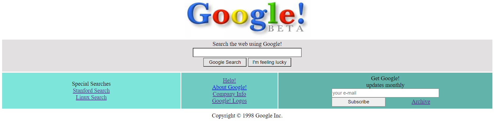

# GoogleBeta Page 

GoogleBeta sayfasını cloneladığım projemde README.md , index.html dosyaları ve css klasörü içinde style.css dosyası , img klasörü içerisinde google.png ve Proje.png dosyaları mevcuttur.




# İnstallation

```
https://github.com/reozmen/google-beta.git
```

# Published Project

[GoogleBetaProject](https://reozmen.github.io/google-beta/)